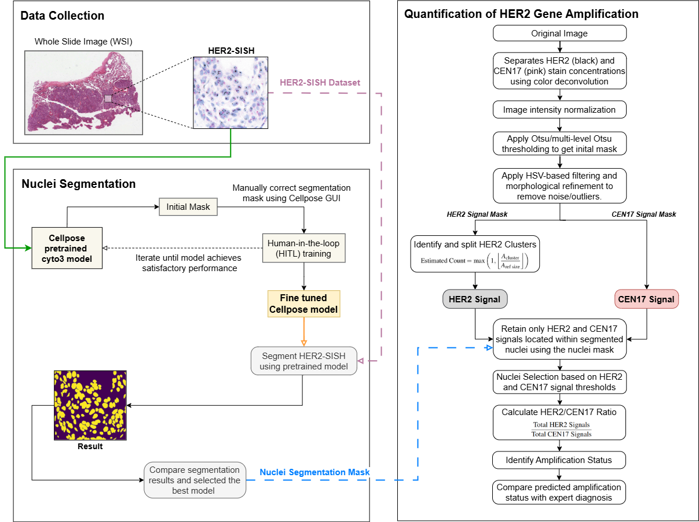
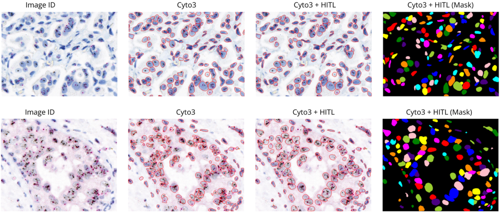
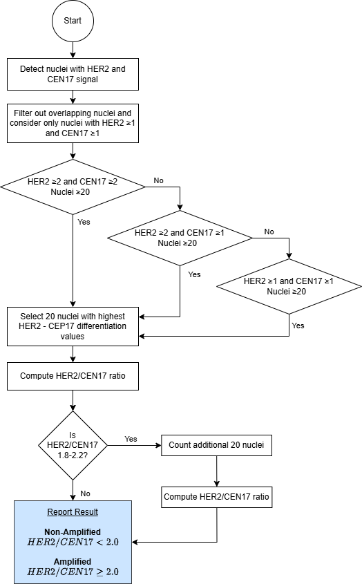
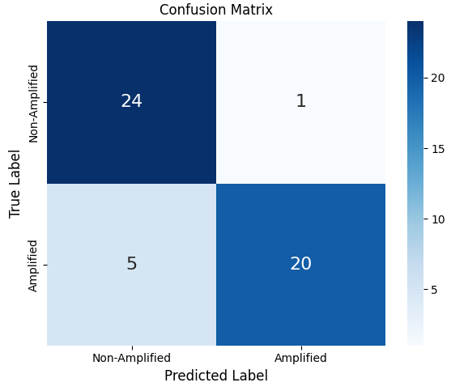
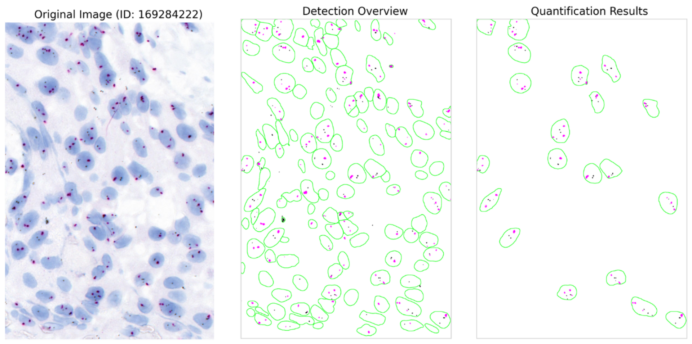
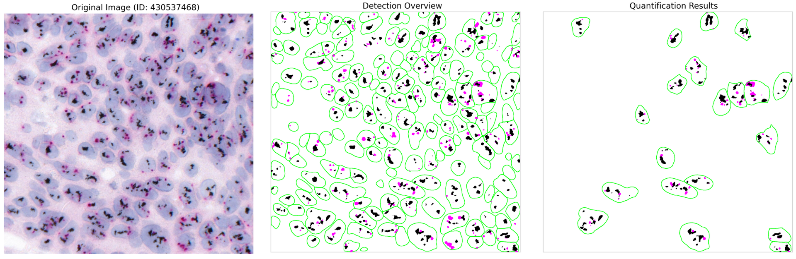

# **HER2-SISH Nuclei Segmentation and Signal Quantification Pipeline**

## **Overview**

This project presents an automated pipeline for **HER2 gene amplification analysis** in HER2-SISH histopathology images. The framework integrates **deep learning-based nuclei segmentation** with a **custom signal quantification pipeline** to assist in breast cancer diagnosis.

Manual analysis of pathology slides is time-consuming and subjective. This project aims to provide a **reliable and scalable computational approach** for identifying HER2 amplification status.

---

## **Proposed Framework**

The pipeline consists of three main stages:

1. **Data Collection**
2. **Nuclei Segmentation**
3. **Signal Quantification**



---

## **1. Nuclei Segmentation**

* **Model**: Cellpose ("cyto3") pretrained model
* **Approach**: Human-in-the-Loop (HITL) fine-tuning using Cellpose GUI
* **Goal**: Accurately segment nuclei without requiring large annotated datasets

### Key Highlights:

* Iterative HITL refinement improves segmentation performance
* Adapted to domain-specific HER2-SISH images
* Handles challenging cases such as overlapping and low-contrast nuclei



---

## **2. Signal Quantification**

A multi-stage image processing pipeline was developed to detect and quantify **HER2** and **CEN17** signals.

### Pipeline Components:

* **Color Deconvolution**

  * Separates HER2 (black) and CEN17 (pink) signals
* **Signal Detection**

  * Thresholding, color filtering, and morphological processing
* **Cluster Handling**

  * Estimates signal counts in dense regions
* **Nuclei-Constrained Quantification**

  * Computes HER2/CEN17 ratio within segmented nuclei

---

## **HER2 Amplification Classification**



---

## **Results**

The pipeline was evaluated on **50 HER2-SISH image regions**:

| Metric    | Score  |
| --------- | ------ |
| Accuracy  | 88.00% |
| Precision | 95.24% |
| Recall    | 80.00% |
| F1 Score  | 86.96% |

### Key Observations:

* Strong agreement with expert annotations
* Robust performance across varying staining conditions
* Effective handling of clustered and sparse signals



---

## **Qualitative Results**

### Non-Amplified Example



### Amplified Example



---

## **Dataset**

* Source: Clinical dataset (UMMC collaboration)
* Total: 232 Regions of Interest (ROIs)
* Evaluation: 50 ROIs (balanced amplified & non-amplified)
* No ground truth segmentation masks provided

---

## **Project Structure**

```
├── Nuclei Segmentation_Cellpose HITL.ipynb
├── Signal Quantification Pipeline.ipynb
├── images/
├── README.md
```

---

## **Environment**

This project was developed using **Kaggle Notebooks**.
Paths such as `/kaggle/input/...` are used for dataset access.

---

## **Limitations**

* No ground truth segmentation masks for quantitative evaluation
* Rule-based signal detection may be sensitive to staining variation
* Performance may vary on unseen datasets

---

## **Future Work**

* Develop supervised learning-based signal detection
* Improve generalization across different staining conditions
* Expand dataset with annotated ground truth
