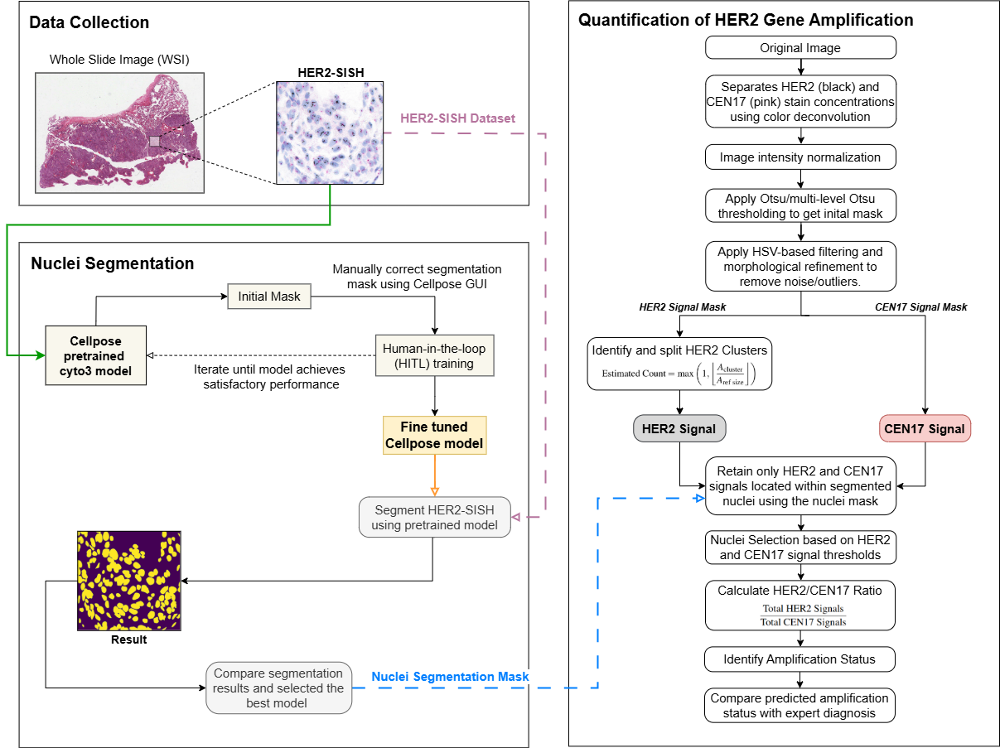
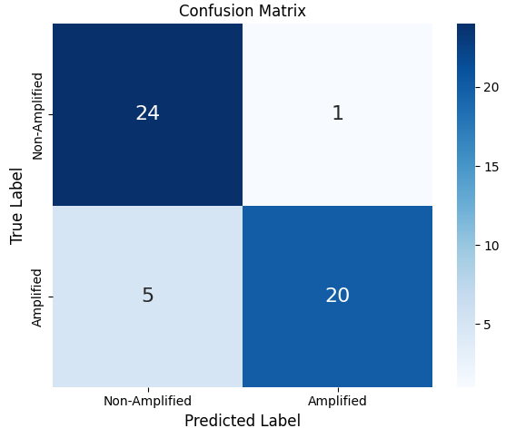

# HER2-SISH Nuclei Segmentation and Signal Quantification Pipeline 🔬

## Overview

This project presents an automated pipeline for **HER2 gene amplification analysis** in HER2-SISH histopathology images. The framework integrates **deep learning-based nuclei segmentation** with a **custom signal quantification pipeline** to assist in breast cancer diagnosis.

Manual analysis of pathology slides is time-consuming and subjective. This project aims to provide a **reliable and scalable computational approach** for identifying HER2 amplification status.

## Interactive Web App ##
The repository includes an interactive **Streamlit** application that allows users to **upload** pathology images, **switch** between segmentation models or comparison mode, and **visualize** segmentation results together with HER2/CEN17 ratio **analysis**.

[](https://nuclei-segmentation-her2-amplification.streamlit.app/)

---

## Dataset

* Source: Private clinical dataset (University Malaya Medical Centre, UMMC collaboration)
* Total: 232 Regions of Interest (ROIs)
* Evaluation sets: **50** selected ROIs (25 amplified, 25 non-amplified)
* **No ground truth** segmentation masks provided


---

## **Proposed Framework**

The pipeline consists of three main stages:

- Data Collection
- Nuclei Segmentation
- Signal Quantification

<p align="center">
  
</p>

### *1. Nuclei Segmentation*

* Model: Cellpose ("cyto3") pretrained model
* Approach: Human-in-the-Loop (HITL) fine-tuning using Cellpose GUI
* Goal: Accurately segment nuclei without requiring large annotated datasets

#### Key Highlights:

* Iterative HITL refinement improves segmentation performance
* Adapted to domain-specific HER2-SISH images
* Handles challenging cases such as overlapping and low-contrast nuclei


### *2. Signal Quantification*

A multi-stage image processing pipeline was developed to detect and quantify **HER2** and **CEN17** signals.

#### Pipeline Components:

* **Color Deconvolution**: Separates HER2 (black) and CEN17 (pink) signals
* **Signal Detection**: Thresholding, color filtering, and morphological processing
* **Cluster Handling**: Estimates signal counts in dense regions
* **Nuclei-Constrained Quantification**: Computes HER2/CEN17 ratio within segmented nuclei


## **HER2 Amplification Classification**

- HER2/CEN17 ratio ≥ 2.0: **Amplified**
- HER2/CEN17 ratio < 2.0: **Non-Amplified**


## Results

The pipeline was evaluated on **50 HER2-SISH image regions**:

| Metric    | Score  |
| --------- | ------ |
| Accuracy  | 88.00% |
| Precision | 95.24% |
| Recall    | 80.00% |
| F1 Score  | 86.96% |

## Key Observations

* Strong agreement with expert annotations
* Robust performance across varying staining conditions
* Effective handling of clustered and sparse signals

<p align="center">
  
</p>


## Installation and Requirements

1. In your terminal, clone the repository:
```bash
https://github.com/Enqing07/nuclei-segmentation-her2-amplification.git
cd nuclei-segmentation-her2-amplification
```
2. Install dependencies:
```bash
pip install -r requirements.txt
```
3. Run the app:
```bash
streamlit run app.py
```
